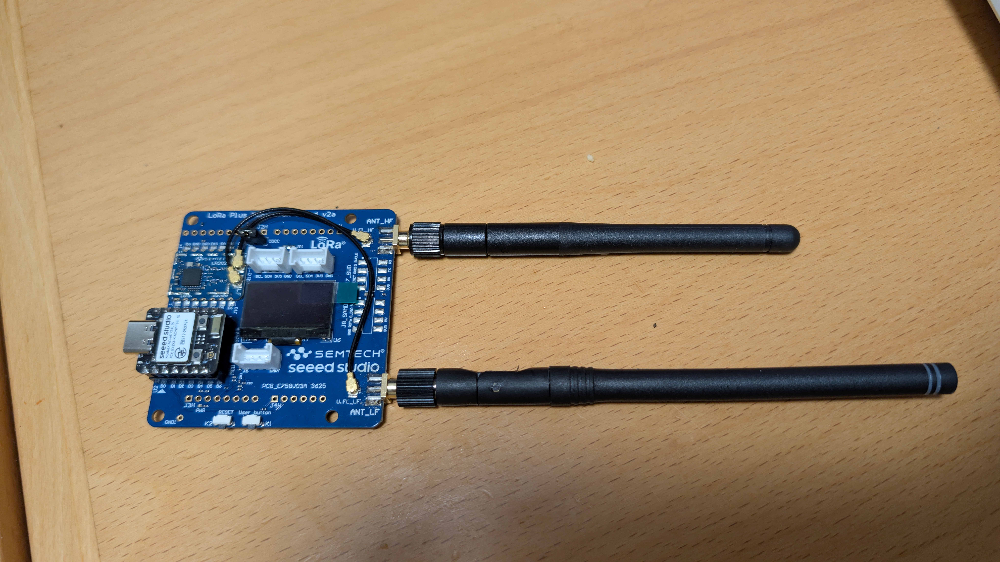
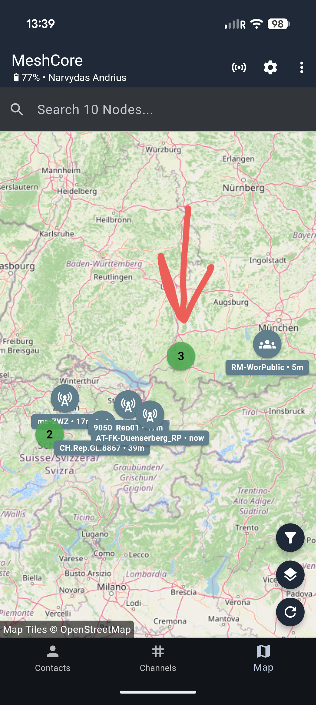
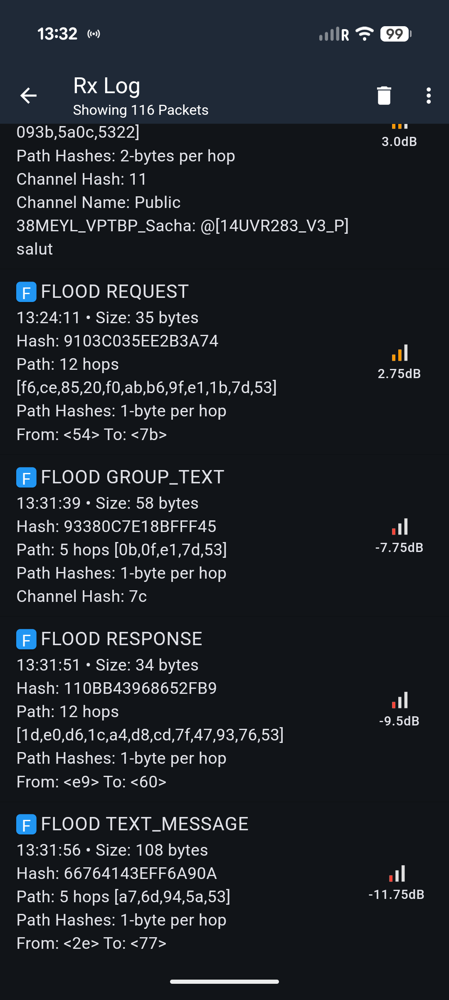
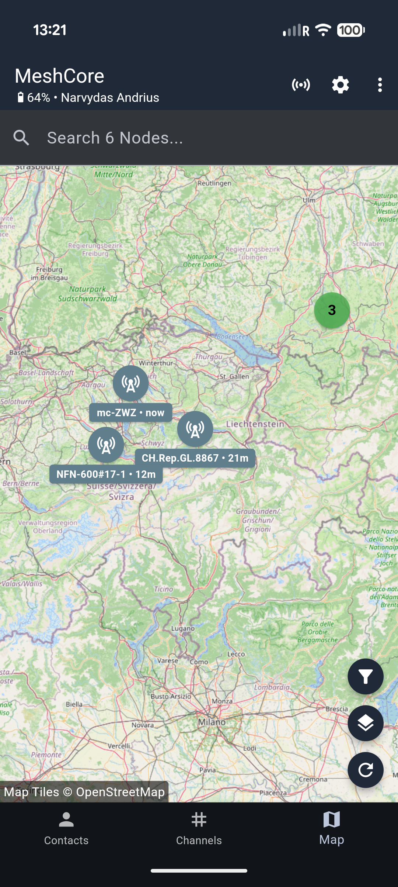

# LR2021 MeshCore on Zephyr — SeeedStudio Semtech LR2021 LoRa Plus EVK

**First working MeshCore firmware for the SeeedStudio Semtech LR2021 LoRa Plus Evaluation Kit.**



The [Semtech LR2021](https://www.semtech.com/products/wireless-rf/lora-plus/lr2021) is a 4th-generation LoRa chip (LoRa Plus, released March 2025) with Sub-GHz + 2.4 GHz capability. As of August 2026, **Zephyr RTOS has no official LR2021 driver.** This project is the first complete, working implementation.

The firmware is built on [MeshCore](https://github.com/meshcore-dev/MeshCore) (mesh routing firmware) and [ZephCore](https://github.com/liquidraver/ZephCore) (Zephyr port of MeshCore), with a custom SPI driver for the LR2021.

**What you get:**
- ✅ Full MeshCore functionality (flood routing, direct messages, repeater mode, companion mode)
- ✅ All Sub-GHz frequencies (868 MHz EU, 915 MHz US, 433/470 MHz, etc.)
- ✅ Mesh network with mobile app (MeshCom / MeshCore Android app)
- ✅ Pre-built firmware files — flash and go

**Field-tested:** signal traveled **120+ km through intermediate repeaters** on 2026-08-02.



---

## What You Need to Buy

You need the **SeeedStudio Semtech LR2021 LoRa Plus Evaluation Kit** (EU 868 MHz Version).

| Part | Link | ~Price |
|------|------|--------|
| **LR2021 LoRa Plus EVK (EU 868 MHz V2.0)** | [Seeed Studio](https://www.seeedstudio.com/LR2021-LoRa-Plus-Evaluation-kit-868Mhz-EU-V2-0-p-6697.html) | ~$50 |

The kit comes with **two of everything** (2× XIAO nRF54L15, 2× expansion board, 2× antennas) — enough for a point-to-point setup right away.

**Contents:**
- 2× [Seeed Studio XIAO nRF54L15](https://wiki.seeedstudio.com/xiao_ble/) (Nordic nRF54L15 core board)
- 2× LR2021 LoRa Plus Expansion Board (with Wio-LR2021 module)
- 2× LoRa antennas (Sub-GHz)

For the **US 915 MHz** version, see the [Seeed store](https://www.seeedstudio.com/) for regional variants.

---

## Quick Start — Flash Pre-Built Firmware (No Coding Required)

You have two options: **terminal** (pyocd) or **MeshCore Web Flasher**.

### Option A: MeshCore Web Flasher (Easiest)

This is the **simplest method** — no software installation needed.

1. Open [flasher.meshcore.co.uk](https://flasher.meshcore.co.uk) in **Chrome or Edge** browser
2. Connect your XIAO nRF54L15 via USB-C
3. Select your device from the list
4. Download the `.hex` file from this repo ([Repeater](firmware/repeater/) or [Companion](firmware/companion/))
5. Upload and flash

> **Note:** The web flasher requires WebSerial support. Use Chrome or Edge on desktop.

### Option B: Flash via pyocd (Terminal)

If you prefer command line:

**1. Install pyocd:**
```bash
pip install pyocd
```

**2. Connect your XIAO nRF54L15 via USB-C**

**3. Find your device:**
```bash
pyocd list
```
Look for target `nrf54l` and note the UID.

**4. Flash the firmware:**
```bash
# REPEATER firmware (for a relay/router node):
pyocd flash -t nrf54l -u <YOUR_UID> firmware/repeater/zephyr-f88692c-repeater.hex

# OR COMPANION firmware (for a node connected to phone app):
pyocd flash -t nrf54l -u <YOUR_UID> firmware/companion/zephyr-f88692c-companion.hex
```

**5. Reset the device:**
```bash
pyocd commander -t nrf54l -u <YOUR_UID> -c reset
```

Replace `<YOUR_UID>` with your device's unique ID (e.g. `8802F48F`).

---

## Repeater vs Companion — What's the Difference?

| | **Repeater** | **Companion** |
|---|---|---|
| **Purpose** | Standalone relay node — listens and forwards messages | Connects to phone app via BLE |
| **Use case** | Hang on a tree, put on a roof — extends mesh range | Everyday use with MeshCom app |
| **BLE** | Off (lower power) | On (connects to phone) |
| **Serial CLI** | Yes (for setup) | Yes (for setup) |
| **Setup via app** | After first USB setup | Direct |

**Typical setup:** Multiple repeaters spread across an area + one companion paired with your phone.

> ⚠️ **Repeater configuration is done ONLY via [config.meshcore.io](https://config.meshcore.io/)** — you configure a repeater through that web page, otherwise it won't work. Use the **Repeater** option there, enter your repeater's public key, and set the admin password (`123456` by default).

---

## First-Time Setup (via USB Serial)

After flashing, you need to configure your device via serial terminal (115200 baud).

### Windows
Use **PuTTY** or **Tera Term**, connect to your COM port at 115200 baud.

### macOS / Linux
```bash
# Find your serial port
ls /dev/ttyACM*    # Linux
ls /dev/tty.usb*   # macOS

# Connect (use screen, minicom, or picocom)
screen /dev/ttyACM0 115200
# or
minicom -D /dev/ttyACM0 -b 115200
```

### Initial Configuration Commands
Type these commands one by one (press Enter after each):

```
time <UNIX_TIMESTAMP>
```
> Get your current Unix timestamp at [unixtimestamp.com](https://www.unixtimestamp.com/). This is important — the device has no clock battery and resets to 1970 on power loss.

```
set meshtimesync on
```
> Enables automatic time synchronization from the mesh network. Survives reboots.

```
password 123456
```
> **Default admin password is `123456`** (max 15 characters). This is used for remote admin login from the app. Keep it as `123456` so other users / the app can log in, or change it with `password <NEW>`.

```
set tx 22
```
> Sets transmit power to 22 dBm (maximum for LR2021 in EU region).

```
set agc.reset.interval 4
```
> Optimal antenna gain reset interval.

### Verify Setup
```
clock
get tx
get meshtimesync
get public.key
```

The `public.key` output is your device's identity — you'll need to add this to the app as a contact.

### Adding Your Repeater to the App

> ⚠️ **Configure your repeater at [config.meshcore.io](https://config.meshcore.io/) first** — a repeater is configured on that web page (generate/find your public key prefix, set admin password `123456`), otherwise the app won't see it. Then add it in the app:

1. Open MeshCom / MeshCore app on your phone
2. Go to **Contacts** → **Add Contact**
3. Enter the **public key** from `get public.key`
4. Set type to **Repeater**
5. Enter admin password (`123456` by default)

> ⚠️ **Important:** Add as **admin first**, not guest. Guest login can overwrite admin permissions.

---

## Pre-Built Firmware Files

| File | Build | Description |
|------|-------|-------------|
| [`firmware/repeater/zephyr-f88692c-repeater.hex`](firmware/repeater/zephyr-f88692c-repeater.hex) | f88692c | Repeater — standalone relay node |
| [`firmware/companion/zephyr-f88692c-companion.hex`](firmware/companion/zephyr-f88692c-companion.hex) | f88692c | Companion — BLE-connected for phone app |

Build: `f88692c` (2026-08-02) · Based on MeshCore 1.16.7 + Zephyr · CI tested ✅

### Useful CLI Commands

| Command | What it does |
|---------|-------------|
| `stats.daily` | Daily traffic stats (works via radio) |
| `get public.key` | Device public key |
| `get prv.key` | Device private key — **back this up!** |
| `get acl` | Show connected admin clients |
| `clock` | Show current time |
| `time <epoch>` | Set time manually |
| `set tx <dBm>` | Set TX power (max 22) |
| `set freq <Hz>` | Set frequency (e.g. `set freq 868000000`) |
| `reboot` | Reboot device |
| `password <pw>` | Change admin password |

---

## What Works

- ✅ **All sub-GHz frequencies** — 868 MHz (EU), 915 MHz (US), 433 MHz, 470 MHz, and others supported by the LR2021
- ✅ **LoRa modulation** — BW 62.5–500 kHz, SF 5–12, CR 4/5–4/8
- ✅ **Full MeshCore mesh routing** — flood routing, direct messages, path discovery
- ✅ **Repeater mode** — standalone relay that forwards messages
- ✅ **Companion mode** — BLE connection to phone app
- ✅ **Mobile app** — full functionality via MeshCom / MeshCore Android app
- ✅ **Daily stats** — 90-day traffic counter stored in flash (survives reboots)
- ✅ **Boot LED** — 60-second blink on power-up, then off
- ✅ **Long range** — field-tested: signal traveled 120+ km through intermediate hops

### Field Test Results (2026-08-02)





| Metric | Result |
|--------|--------|
| Longest distance | **159.99 km** (Repeater Kriens, 123 hops) |
| Nodes detected | **10 nodes** via mesh |
| Packets logged | **116 packets** in one session |
| Packet types | Flood Request, Response, Group Text, Text Message |
| Hops observed | 5–12 intermediate nodes |
| Signal strength | +2.75 dB to −11.75 dB |
| Radio config | 869.618 MHz, BW 62.5 kHz, SF8, CR 4/8, TX 22 dBm |

---

## Known Issues

| Issue | Description | Status |
|-------|-------------|--------|
| **2.4 GHz does not work** | MeshCore does not support 2.4 GHz operation. Only sub-GHz works. This is a MeshCore limitation, not a driver bug. | Upstream |
| **Admin login after reboot** | Remote admin login via LoRa may fail after device reboots. App shows "password error" or "not reachable." This is a known upstream MeshCore issue ([#983](https://github.com/meshcore-dev/MeshCore/issues/983), [#2955](https://github.com/meshcore-dev/MeshCore/issues/2955)). | Upstream bug |
| **SNR always 0.0 dB** | The LR2021 chip returns SNR=0 for all packets. This is a chip hardware limitation, not a firmware bug. Does not affect functionality. | Chip limit |
| **Clock resets to 1970** | No RTC or GPS on the XIAO nRF54L15. Time resets on power loss. Use `set meshtimesync on` to auto-sync from mesh. | Workaround |
| **No display support** | The OLED on the expansion board is not supported (I2C disabled). Not needed for operation. | Not planned |
| **Power consumption** | Measured with cheap multimeter only — results unreliable. LR2021 continuous RX draws ~5.7 mA. Total system current not accurately characterized yet. | Needs proper measurement |

---

## Building from Source

> **Note:** Most users should use the pre-built `.hex` files above. Building from source is for developers.

### Prerequisites
- Python 3.10+
- [west](https://docs.zephyrproject.org/latest/develop/west/index.html) (Zephyr meta-tool)
- Zephyr SDK (Nordic nRF54L15 support)

### Build Steps
```bash
# Clone the source repository
git clone https://github.com/protozauras/ZephCore.git
cd ZephCore
git checkout lr2021-rx-order-fix

# Initialize west workspace
west update

# Build repeater
west build -b xiao_ble/nrf54l15/cpuapp -d build-repeater \
  -- -DCONFIG_APP_REPEATER=y

# Build companion
west build -b xiao_ble/nrf54l15/cpuapp -d build-companion \
  -- -DCONFIG_APP_COMPANION=y

# Output: build-repeater/zephyr/zephyr.hex or build-companion/zephyr/zephyr.hex
```

---

## Hardware Photos

**The LR2021 LoRa Plus Expansion Board (Wio-LR2021 module):**


- Semtech LR2021 chip — 4th generation LoRa, Sub-GHz + 2.4 GHz
- Two antenna connectors: ANT_HF (high frequency) and ANT_LF (low frequency)
- PCB: "LR2021 LoRa Plus Shield v2a"
- Connected to XIAO nRF54L15 via SPI

---

## Technical Details

| Parameter | Value |
|-----------|-------|
| **Chip** | Semtech LR2021 (LoRa Plus, 4th gen) |
| **MCU** | Nordic nRF54L15 (ARM Cortex-M33, Zephyr RTOS) |
| **Interface** | SPI (up to 10 MHz) |
| **Frequency** | Sub-GHz: 150–960 MHz (EU 868, US 915, 433, 470, etc.) |
| **Modulation** | LoRa, GFSK, GMSK, FLRC, 4-FSK, O-QPSK |
| **TX power** | Up to +22 dBm |
| **Sensitivity** | −143 dBm @ SF12/BW62.5 kHz |
| **Mesh protocol** | MeshCore (flood routing) |
| **App** | MeshCom / MeshCore (Android) |
| **Flash method** | pyocd (CLI) or MeshCore web flasher |

---

## Driver Implementation Notes

The LR2021 Zephyr driver was built by cross-referencing:
1. **RadioLib** `src/modules/LR2021/` — Arduino-compatible reference implementation by [jgromes/RadioLib](https://github.com/jgromes/RadioLib)
2. **MeshCore** `RadioLibWrappers.cpp` — how MeshCore wraps RadioLib for radio operations
3. **MeshCore PR #2739** — the only known MeshCore LR2021 adaptation (by c0r3d0r)

**Key pitfall for developers:** The `0x0212` (GetRxPacketLength) response layout is `[status_16bit][0x14 status_byte][length]`. Many libraries (RadioLib, TheClams) read `data[0]<<8|data[1]` which works on their hardware but gives `0x14xx` on the Wio-LR2021 module. **We read `data[2] & 0xFF`** (confirmed by live testing).

---

## Links

- **MeshCore firmware:** https://github.com/meshcore-dev/MeshCore
- **ZephCore (Zephyr port):** https://github.com/liquidraver/ZephCore
- **RadioLib (reference):** https://github.com/jgromes/RadioLib
- **Semtech LR2021 product page:** https://www.semtech.com/products/wireless-rf/lora-plus/lr2021
- **Wio-LR2021 module datasheet:** [PDF](https://files.seeedstudio.com/wiki/Wio-LR2021/res/Wio-LR2021%20Module%20Datasheet.pdf)
- **Seeed Wiki (Getting Started):** https://wiki.seeedstudio.com/semtech_lr2021_evk_getting_started/
- **LR2021 on Zephyr (this repo):** https://github.com/protozauras/lr2021-meshcore-zephyr

---

## License

MIT License — see [LICENSE](LICENSE).

MeshCore is licensed under MIT by Scott Powell / rippleradios.com.
ZephCore is licensed under MIT (2025-2026 ZephCore contributors).

---

## Acknowledgments

- [meshcore-dev/MeshCore](https://github.com/meshcore-dev/MeshCore) — the mesh networking firmware this is built on
- [liquidraver/ZephCore](https://github.com/liquidraver/ZephCore) — Zephyr port of MeshCore
- [jgromes/RadioLib](https://github.com/jgromes/RadioLib) — reference radio library
- [Seeed Studio](https://www.seeedstudio.com/) — hardware
- [Semtech](https://www.semtech.com/) — LR2021 chip